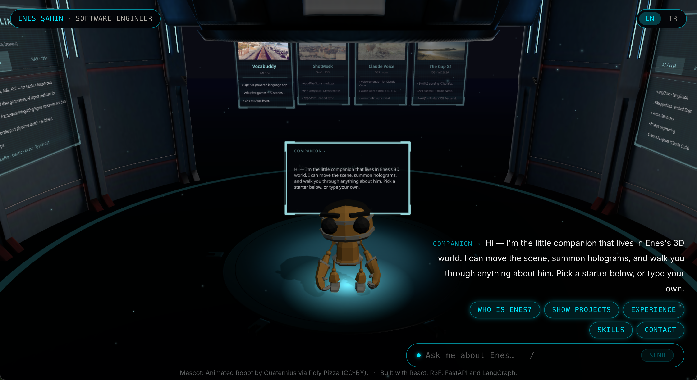
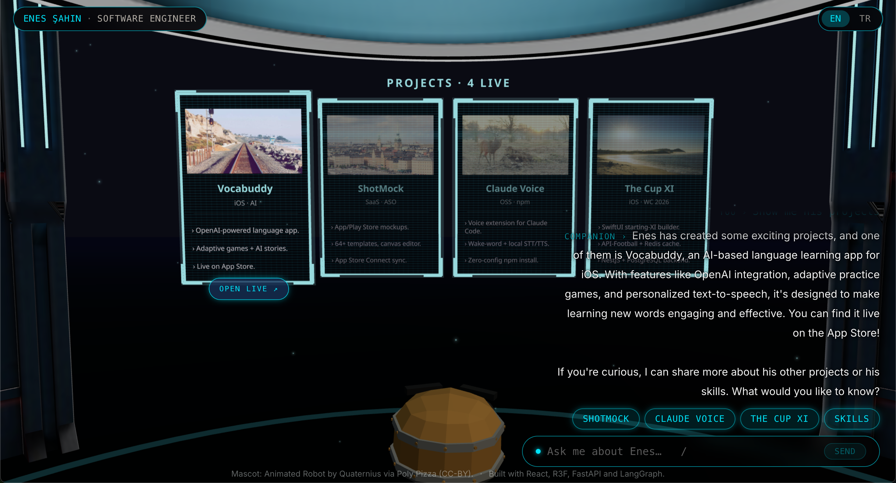
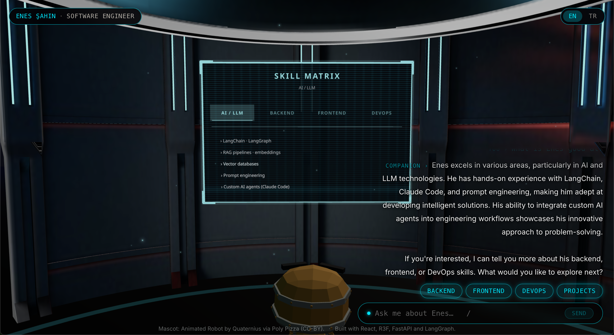

# 3D Portfolio

A chat-driven robot mascot in a sci-fi platform. The visitor types in
the chat dock; the LangGraph agent replies with prose AND fires
structured tools (camera dolly, mascot walk, hologram open, follow-up
chips) that animate the 3D scene in real time.



---

## What's on screen

- **Mascot** centre stage (rigged GLB, 13 idle/gesture clips). It walks
  to wall stations when a section becomes active and turns to face the
  panel.
- **Three walls always render** as ambient signage; the active one
  bumps to full opacity + slow pulse:
  - **Back wall** — Projects (Vocabuddy · ShotMock · Claude Voice · The Cup XI)
  - **Left wall** — Experience timeline (ING → Formica AI → Nar Sistem)
  - **Right wall** — Skills matrix (AI · Backend · Frontend · DevOps)
- **Speech bubble** above the mascot mirrors the streaming agent reply.
- **Contact card** floats beside the mascot when asked, with mailto:/
  LinkedIn tap targets.

| Projects wall                            | Skills wall                            |
| ---------------------------------------- | -------------------------------------- |
|  |  |

---

## High-level architecture

```
┌──────────────────────────┐                 ┌──────────────────────────┐
│ React 19 + R3F frontend  │                 │ FastAPI + LangGraph BE   │
│                          │                 │                          │
│ ChatDock ──POST /chat───────────────────►  │  /chat (SSE stream)      │
│                          │   {messages}    │   ▼                      │
│ useChatStream            │                 │  create_react_agent      │
│   ▼                      │  ◄── token ─── │   ├─ ChatOpenAI          │
│ stream.ts (SSE consumer) │  ◄── ui    ─── │   ├─ 16 tools            │
│   ▼                      │  ◄── done  ─── │   │   (camera_*, mascot_*,│
│ applyUiEvent (root       │                 │   │    content_*, suggest)│
│  dispatcher; switch on   │                 │   └─ InMemorySaver       │
│  every UiEvent kind)     │                 │      (per thread_id)     │
│   ▼                      │                 │                          │
│ Zustand slices           │                 │  Pydantic v2 UiEvent     │
│  ├─ world (camera, hg)   │                 │  discriminated union     │
│  ├─ mascot (zone, anim)  │                 │  ◄══ contract test ═════►│
│  ├─ chat (messages)      │                 │  parity with FE types    │
│  └─ ...                  │                 │                          │
│   ▼                      │                 └──────────────────────────┘
│ <HologramStage>          │
│ <CameraRig>              │
│ <Mascot> + locomotion    │
└──────────────────────────┘
```

### Frontend (`/src`)

- **`world/`** — R3F scene: sci-fi platform GLB at scale `[0.5, 1, 0.5]`,
  3 wall hologram slots, reflective floor, drei `<Sparkles>`,
  `<Lightformer>` 3-point env map. Wall holograms share `useHoloFade` +
  `useWallSlot` so adding a 4th wall type is a 2-line entry.
- **`mascot/`** — `RobotExpressive.glb` rigged mascot. `useMascotLocomotion`
  hook owns position lerp / arrival / yaw / hover-scale per frame so
  `Mascot.tsx` itself stays a coordinator.
- **`stores/`** — Zustand sliced state. `dispatcher.ts` is the single
  typed switch that turns every backend `UiEvent` into the right slice
  action; rename a slice action and the dispatcher fails to compile.
- **`chat/`** — native SSE (no React Query / EventSource — we POST the
  history). `useChatStream` is the only place that knows about send /
  abort / parse.

### Backend (`/backend`)

- **`/chat` SSE endpoint** — streams `ready`, `token`, `ui`, `done`,
  `error` events. `request_id` + `thread_id` bound to structlog
  contextvars so every log line down-stream picks them up.
- **LangGraph ReAct agent** — `create_react_agent` + 16-tool palette +
  in-memory checkpointer (single-instance only; bounded LRU eviction at
  256 threads).
- **Pydantic v2 contract** — `UiEvent` discriminated union; a contract
  test in `tests/test_tools.py` asserts every tool in `ALL_TOOLS` has a
  matching event variant + the `kind` literals match what the frontend's
  `src/types/tools.ts` expects.
- **LLM provider seam** — `settings.llm_provider` + `_make_model()` in
  `graph.py`. Adding Anthropic = one branch + an `anthropic_api_key`
  alias. Existing `OPENAI_*` env vars still work via
  `AliasChoices("LLM_*", "OPENAI_*")`.

---

## Stack

| layer    | tech                                                          |
| -------- | ------------------------------------------------------------- |
| frontend | Vite 7 · React 19 · TypeScript strict · Tailwind 4 · Biome 2  |
| 3D       | @react-three/fiber · @react-three/drei · @react-three/postprocessing |
| state    | Zustand 5 (sliced + typed root dispatcher)                    |
| chat     | native SSE · custom `useChatStream` hook                       |
| backend  | FastAPI · uvicorn · LangGraph · LangChain · Pydantic v2       |
| LLM      | OpenAI (default); provider-pluggable                          |
| logging  | structlog (JSON + contextvars)                                |
| tooling  | uv (Python) · pnpm (JS) · pytest · ruff · mypy                |

---

## Run locally

```bash
# frontend
pnpm install
pnpm dev                         # http://localhost:5173

# backend (separate shell)
cd backend
cp .env.example .env             # set OPENAI_API_KEY (or LLM_API_KEY)
uv run uvicorn app.main:app --reload --port 8000 --workers 1
```

CORS defaults to `http://localhost:5173` and `http://127.0.0.1:5173`;
see `backend/app/core/config.py` for the validator.

---

## Deploy

> **IMPORTANT: deploy with `--workers 1` only.**
> InMemorySaver (LangGraph checkpointer) and slowapi's in-memory store
> both live in-process. Multiple workers silo their state silently and
> leak rate-limit + session guarantees — a visitor's chat thread can
> land on a worker that has never seen their `thread_id`, and rate-limit
> counters split N ways. Swap to `AsyncRedisSaver` + a Redis-backed
> slowapi store before scaling out.

The shipped `backend/Dockerfile` pins `--workers 1` in its CMD; if you
run uvicorn directly (systemd, Procfile, k8s manifest, etc.), set the
same flag yourself. Horizontal scaling = Redis first, more workers
second.

---

## Credits

- Mascot: **Animated Robot** by [Quaternius](https://quaternius.com)
  via Poly Pizza · CC-BY
- Built by [Enes Şahin](https://linkedin.com/in/menesahin)
